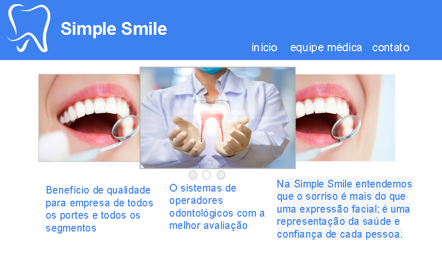

# README - Site da Clínica Odontológica 
## Descrição:

Este repositório contém o código-fonte e os recursos necessários para o site da nossa clínica odontológica. O site foi desenvolvido para fornecer informações sobre nossos serviços, profissionais e facilitar o contato com nossos pacientes.

## Conteúdo:

1. **Páginas Principais:**
  * **Página Inicial:** Uma breve descrição da clínica e apresentação de serviços.

    

    

  * **Equipe médica:** Informações sobre a equipe e nossa abordagem. 

    

  * **Contato:** Formulário de contato, informações de localização e números de telefone.

    

  2. **Design Responsivo: (ainda não feito)**
  * O site é projetado para ser visualizado em dispositivos móveis, garantindo uma experiência consistente em diferentes tamanhos de tela.

    

    

    

    

    

Tecnologias utilizadas  |
--------- |
HTML5 |
CSS3 |
JavaScript |

## Como Executar Localmente:

1.  acesse o site com o link https://abnersilva021.github.io/clinicaOdonto/

## Esse é um projeto público, aceitamos feedback para poder aperfeiçoá-lo.

